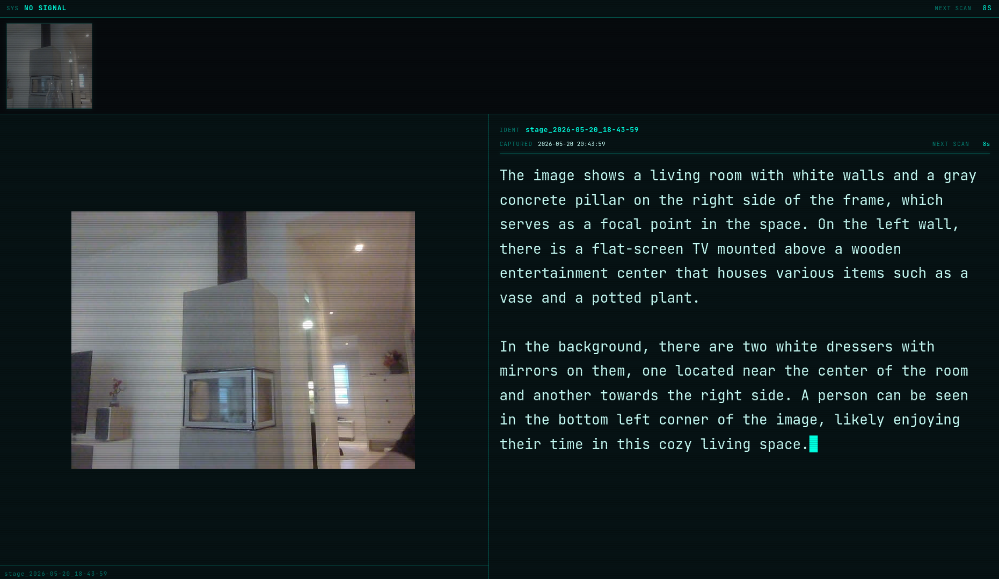

# Art Display

This program uses a webcamera and a local AI (LLM) to create a dynamic art display.

It captures images from a web camera at regular intervals,
generates descriptions using an LLM, and serves them through a web interface.

The web interface has a sci-fi aesthetic, and shows the latest image with a typewriter
description and a strip of recent thumbnails.

## Screenshots



## Quick start

```bash
npm install
npm run theatre      # full display mode — inhibits sleep, starts server + webcam
```

Or without theatre mode:

```bash
npm run watch        # server + webcam, auto-restarts on file changes
npm run web-cam      # webcam capture only
npm start            # server only
```

## How it works

```
webcam.js  →  images/  →  server.js (Ollama worker)  →  GET /images  →  client/
 capture        disk        describe & serve             REST API        display
```

1. `webcam.js` saves a JPEG to `images/` every 10 seconds.
2. `server.js` detects new images and calls Ollama to generate a description, newest-first.
3. The browser polls `/images` every 10 seconds and displays the latest described image.

## Requirements

- Node.js
- [Ollama](https://ollama.com) running locally with the `moondream` model pulled
- `ffmpeg` and a v4l2 webcam (for capture)

## Configuration

See [SPEC.md](SPEC.md) for full server and client documentation and [WEBCAM.md](WEBCAM.md) for webcam options.
